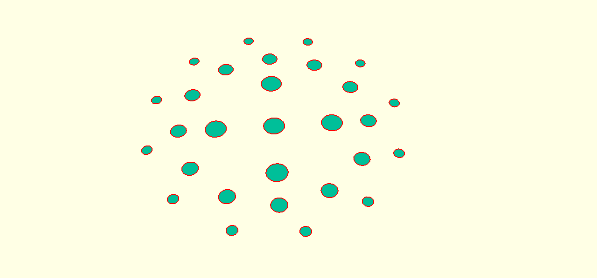
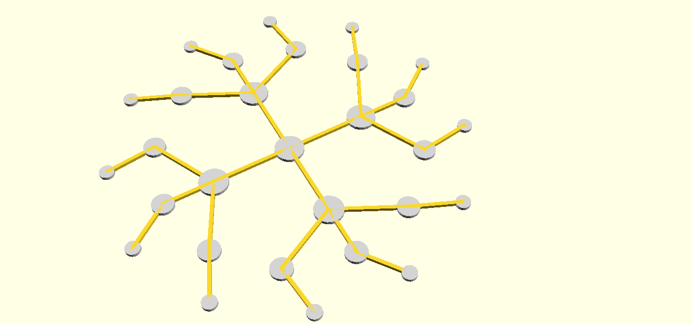

# Spiral Model
Constructed with OpenSCAD (https://www.openscad.org/) Version 2019.05.

## Usage

### ring_structure
Main input is the array `ring_structure` where each element has to have the following structure: </br>
`number of objects`, `distance to center`, `radius of sphere`[, `rotation`] <br>
Together each of those elements desribe one ring in the structure.
Each ring consists of a number of circles equal to `number of objects`. 
Those are evenly distributed around the center of the structure, with the distance equal to the `distance to center`.
After the circles are set they need to be interconnected to form one structure. 
This is done by checking for each circle which other inner circle is closest and connecting both of them with a square.
For the innermost ring the connection is done by connecting the circles with each other if it's more than one.
For this to be done successfully the `ring_structure` has to be sorted by the user from outmost ring (highest `distance to center` value) first to innermost ring (lower `distance to center`: <br>
```openscad
ring_structure = [
    outmost ring,
    second outmost ring,
    ...,
    second innermost ring,
    innermost ring
];
```
Example pictures for the ring_structure = [[12, 48, 2, 10], [12, 36, 3], [4, 22, 4], [1, 0, 4]]


Just the rings.


Bridges in yellow connecting the outer with the inner circles, building one complete 2D structure.

#### Number of objects
Number of created objects in the ring that are distributed evenly around the center of the structure.


#### Distance to center
Distance of the center points of the circles to the center of the ring structure.


#### Radius of sphere
It's the radius of the circles the ring consists off.


#### [Rotation]
Optional parameter that gives additional rotation to the current ring with the value in degree.


### linear_extrude
The linear_extrude command contains the other two interesting parameter, `height` and `twist`. This command extrudes the 2D structure created before and twists it to give it a helix like shape.

#### height
Gives the height of the completed 3D structure.


#### twist
Gives the twist that is added to the 2D structure on the way up to the height in degrees.


